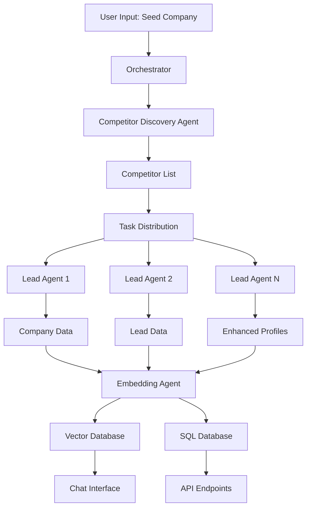

# Agent System Architecture Documentation

## Overview

The Multi-Agent Lead Research & Competitive Intelligence System is built around a sophisticated multi-agent architecture that coordinates specialized AI agents to perform competitive research and lead generation tasks. This document provides a detailed explanation of how the agent system works.

## Core Components

### 1. Multi-Agent Orchestrator (`orchestrator.py`)

The orchestrator is the central command center that coordinates all agent activities:

```python
class MultiAgentOrchestrator:
    def __init__(self, openrouter_api_key, apollo_api_key, max_concurrent_agents=5):
        # Initialize specialized agents
        self.competitor_agent = CompetitorDiscoveryAgent(openrouter_api_key)
        self.lead_agent = LeadDataAgent(apollo_api_key, openrouter_api_key)
        self.embedding_agent = EmbeddingAgent(openrouter_api_key)
        
        # Task management
        self.active_tasks = {}
        self.task_queue = []
        self.executor = ThreadPoolExecutor(max_workers=max_concurrent_agents)
```

**Key Responsibilities:**
- **Agent Coordination**: Manages multiple agents working in parallel
- **Task Distribution**: Distributes research tasks across available agents
- **Progress Tracking**: Monitors the status of all active agents
- **Error Handling**: Manages failures and retries
- **Resource Management**: Controls concurrency to prevent API rate limiting

### 2. Competitor Discovery Agent (`competitor_agent.py`)

This agent specializes in finding competitors for a given seed company.

**How it works:**
1. **LLM-Based Discovery**: Uses OpenRouter's LLM models to generate a list of potential competitors
2. **Web Search Integration**: Performs web searches to validate and expand the competitor list
3. **Company Validation**: Filters and validates discovered companies
4. **Domain Extraction**: Extracts company domains and basic information

**Sample Process:**
```python
async def discover_competitors(self, seed_company: str, max_competitors: int = 10):
    # Step 1: Generate competitor list using LLM
    prompt = f"List {max_competitors} direct competitors of {seed_company}..."
    competitors = await self.llm_request(prompt)
    
    # Step 2: Validate and enrich competitor data
    validated_competitors = []
    for competitor in competitors:
        if await self.validate_company(competitor):
            validated_competitors.append(competitor)
    
    return validated_competitors
```

### 3. Lead Data Agent (`lead_agent.py`)

This agent specializes in collecting detailed company information and lead data.

**Data Sources:**
- **Apollo API**: Primary source for B2B contact data
- **LinkedIn Intelligence**: Company profile enrichment
- **Web Scraping**: Additional company information
- **LLM Enhancement**: Data cleaning and standardization

**Workflow:**
```python
async def fetch_company_data(self, company_name: str):
    # Step 1: Fetch basic company info from Apollo
    company_data = await self.apollo_client.get_company(company_name)
    
    # Step 2: Enrich with additional web data
    enriched_data = await self.enrich_company_data(company_data)
    
    # Step 3: Standardize using LLM
    standardized = await self.standardize_company_profile(enriched_data)
    
    return standardized

async def fetch_leads_data(self, company_name: str, max_leads: int = 20):
    # Fetch employee/contact data from Apollo
    leads = await self.apollo_client.get_company_contacts(company_name, max_leads)
    
    # Enrich each lead with additional data
    enriched_leads = []
    for lead in leads:
        enriched = await self.enrich_lead_data(lead)
        enriched_leads.append(enriched)
    
    return enriched_leads
```

### 4. Embedding Agent (`embedding_agent.py`)

This agent handles vector embeddings and enables semantic search and chat functionality.

**Key Features:**
- **Vector Database**: Uses ChromaDB for storing embeddings
- **Semantic Search**: Enables natural language queries over collected data
- **Chat Interface**: Provides conversational access to research data
- **Real-time Updates**: Continuously embeds new data as it's collected

**Architecture:**
```python
class EmbeddingAgent:
    def __init__(self, openrouter_api_key: str):
        self.client = chromadb.Client()
        self.collection = self.client.create_collection("lead_intelligence")
        self.model = SentenceTransformer('all-MiniLM-L6-v2')
        self.llm_client = OpenRouterClient(openrouter_api_key)
    
    def embed_company(self, company: CompanyProfile):
        # Create embedding for company profile
        text = f"{company.name} {company.description} {company.industry}"
        embedding = self.model.encode(text)
        
        # Store in vector database
        self.collection.add(
            embeddings=[embedding.tolist()],
            documents=[text],
            metadatas=[{"type": "company", "name": company.name}],
            ids=[f"company_{company.name}"]
        )
```

## Agent Coordination Patterns

### 1. Parallel Execution

The system can run multiple agents simultaneously, each working on different companies:

```python
async def _execute_parallel_research(self, tasks: List[AgentTask]):
    semaphore = asyncio.Semaphore(self.max_concurrent_agents)
    
    async def research_single_company(task: AgentTask):
        async with semaphore:
            await self._research_company(task)
    
    # Execute all tasks concurrently
    await asyncio.gather(*[research_single_company(task) for task in tasks])
```

### 2. Pipeline Processing

Each company goes through a standardized research pipeline:

1. **Company Discovery** → Competitor Agent finds the company
2. **Data Collection** → Lead Agent gathers company and employee data
3. **Data Enhancement** → Lead Agent enriches data using LLM
4. **Embedding Creation** → Embedding Agent creates vectors for search
5. **Storage** → Data stored in both SQL and vector databases

### 3. Error Handling and Resilience

```python
async def _research_company(self, task: AgentTask):
    try:
        self._update_task_status(task.agent_id, "running", 10, f"Starting research")
        
        # Step 1: Company data with retry logic
        company = await self.lead_agent.fetch_company_data(task.company_name)
        if not company:
            self._update_task_status(task.agent_id, "failed", 30, "Company not found")
            return
        
        # Step 2: Leads data with fallback
        leads = await self.lead_agent.fetch_leads_data(task.company_name)
        # Continue even if leads fail
        
        # Step 3: Embedding with error handling
        try:
            self.embedding_agent.embed_company(company)
            if leads:
                self.embedding_agent.embed_multiple_leads(leads)
        except Exception as e:
            self.logger.warning(f"Embedding failed for {task.company_name}: {e}")
        
        self._update_task_status(task.agent_id, "completed", 100, "Success")
        
    except Exception as e:
        self._update_task_status(task.agent_id, "failed", 0, f"Error: {str(e)}")
```

## Data Flow Architecture



## Agent Communication

### 1. Task Status Updates

Agents communicate status through a standardized task system:

```python
@dataclass
class AgentTask:
    agent_id: str
    company_name: str
    task_type: str
    status: str = "pending"  # pending, running, completed, failed
    progress: int = 0        # 0-100%
    message: str = ""
    created_at: datetime = datetime.now()
```

### 2. Real-time Monitoring

The orchestrator provides real-time visibility into agent activities:

```python
def get_all_agent_statuses(self) -> List[Dict[str, Any]]:
    return [
        {
            "agent_id": task.agent_id,
            "company": task.company_name,
            "status": task.status,
            "progress": task.progress,
            "message": task.message,
            "created_at": task.created_at.isoformat()
        }
        for task in self.active_tasks.values()
    ]
```

## Scalability Features

### 1. Concurrency Control

```python
# Configurable concurrency to prevent API rate limiting
MAX_CONCURRENT_AGENTS = 5  # Adjustable based on API limits
semaphore = asyncio.Semaphore(self.max_concurrent_agents)
```

### 2. Resource Management

- **Thread Pool**: Manages computational resources
- **Async/Await**: Non-blocking I/O operations
- **Rate Limiting**: Built-in delays and retry logic
- **Memory Management**: Streaming data processing

### 3. Horizontal Scaling Potential

The agent architecture is designed for easy horizontal scaling:

- **Stateless Agents**: Each agent can run independently
- **Queue-based Tasks**: Tasks can be distributed across multiple instances
- **Shared Storage**: Common database for coordination

## Configuration and Customization

### Agent Behavior Customization

```python
# In orchestrator initialization
class MultiAgentOrchestrator:
    def __init__(self, 
                 openrouter_api_key: str,
                 apollo_api_key: str,
                 max_concurrent_agents: int = 5,
                 agent_timeout: int = 300,
                 retry_attempts: int = 3):
        
        # Customize agent behavior
        self.competitor_agent.max_search_results = 20
        self.lead_agent.max_leads_per_company = 50
        self.embedding_agent.chunk_size = 1000
```

### Environment-based Configuration

```bash
# .env configuration
MAX_CONCURRENT_AGENTS=5      # Number of parallel agents
AGENT_TIMEOUT_SECONDS=300    # Timeout per agent task
RETRY_ATTEMPTS=3             # Number of retries for failed tasks
EMBEDDING_MODEL=all-MiniLM-L6-v2  # Embedding model selection
```

## Performance Optimizations

### 1. Caching Strategy

- **Company Data**: Cache company profiles to avoid duplicate API calls
- **Embedding Cache**: Store computed embeddings for reuse
- **Rate Limit Awareness**: Smart delays to optimize API usage

### 2. Batch Processing

```python
# Process multiple leads in batches
async def embed_multiple_leads(self, leads: List[LeadProfile]):
    batch_size = 10
    for i in range(0, len(leads), batch_size):
        batch = leads[i:i + batch_size]
        await self._embed_lead_batch(batch)
```

### 3. Memory Efficiency

- **Streaming**: Process large datasets without loading everything into memory
- **Garbage Collection**: Automatic cleanup of completed tasks
- **Resource Pooling**: Reuse database connections and API clients

## Monitoring and Debugging

### 1. Comprehensive Logging

```python
# Structured logging throughout the system
self.logger.info(f"Starting research for {company_name}")
self.logger.warning(f"API rate limit hit, retrying in {delay} seconds")
self.logger.error(f"Agent {agent_id} failed: {error}")
```

### 2. Progress Tracking

Real-time progress updates for all agent activities:

```python
# Progress updates at each stage
self._update_task_status(agent_id, "running", 25, "Fetching company data")
self._update_task_status(agent_id, "running", 50, "Collecting leads")
self._update_task_status(agent_id, "running", 75, "Creating embeddings")
self._update_task_status(agent_id, "completed", 100, "Research complete")
```

### 3. Error Analytics

Built-in error tracking and analysis:

```python
# Track common failure patterns
error_stats = {
    "api_failures": 0,
    "timeout_errors": 0,
    "data_validation_errors": 0,
    "embedding_failures": 0
}
```

## Integration Points

### 1. API Integration

Each agent integrates with external services:

- **OpenRouter**: LLM capabilities for all agents
- **Apollo API**: B2B data for Lead Agent
- **Web Search**: Additional data validation
- **ChromaDB**: Vector storage for Embedding Agent

### 2. Database Integration

Dual storage strategy:

- **SQLite**: Structured data (companies, leads, relationships)
- **ChromaDB**: Vector embeddings for semantic search

### 3. Frontend Integration

RESTful API endpoints for frontend communication:

```python
# Agent status endpoint
@app.get("/api/agents/status")
async def get_agent_status():
    return orchestrator.get_all_agent_statuses()

# Chat interface endpoint  
@app.post("/api/chat")
async def chat_with_data(request: ChatRequest):
    return await orchestrator.chat_with_data(request.question)
```

## Security Considerations

### 1. API Key Management

- Environment variable storage for sensitive keys
- Validation of API key presence before agent initialization
- Rate limiting to prevent abuse

### 2. Data Privacy

- No persistent storage of sensitive personal data
- Configurable data retention policies
- GDPR compliance considerations

### 3. Access Control

- CORS configuration for frontend access
- Request validation and sanitization
- Error message sanitization to prevent information leakage

This agent system provides a robust, scalable foundation for competitive intelligence and lead research, with clear separation of concerns and built-in resilience features.
